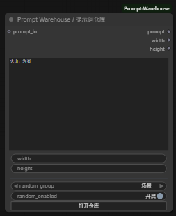
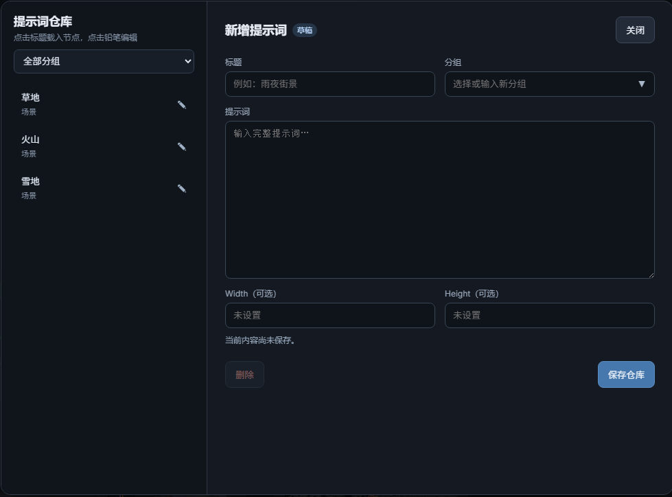

# ComfyUI Prompt Warehouse

当前版本：`v0.2.0`

一个用于整理、复用和随机抽取提示词的 ComfyUI 自定义节点。每条仓库记录包含标题、分组、多行提示词，以及可选的 Width / Height。

## 界面预览

### 节点



### 提示词仓库



## 功能

- 新增、编辑、删除提示词记录
- 自定义分组，并在左侧列表按分组筛选
- 分组输入支持已有候选，也可以直接创建新分组
- 按指定分组或全部记录随机抽取
- 随机抽取时，Prompt、Width 和 Height 保持配套
- 通过左侧 `prompt_in` 接口拼接上游提示词
- 可选接收 `clip` 输入，并输出 `prompt`、`width`、`height`、`conditioning`
- 数据持久化保存在插件目录的 `data/prompts.json`
- 实际仓库数据不受 Git 管理，更新插件不会覆盖该文件
- 提供 `Prompt Line / 单行提示词` 节点，用单行输入框直接输出提示词
- 提供 `Prompt Multiline / 多行提示词` 节点，用多行输入框编辑并输出提示词
- 提供 `Multi LoRA Loader / 多 LoRA 加载器`，可按顺序加载任意多个 LoRA
- 每个 LoRA 可独立启停，以紧凑单行界面调整统一强度
- LoRA 列表及 `Add LoRA` 按钮在工作流重载或重启 ComfyUI 后会自动恢复

## 安装

进入 ComfyUI 的自定义节点目录并克隆仓库：

```bash
cd ComfyUI/custom_nodes
git clone https://github.com/D33MO/ComfyUI-Prompt-Warehouse.git
```

重启 ComfyUI，然后刷新浏览器页面。插件没有第三方 Python 依赖。

## 使用

在节点菜单的 `Prompt Warehouse` 分类中添加 **Prompt Warehouse / 提示词仓库**。

如需一个简单的单行提示词节点，可在同一分类中添加 **Prompt Line / 单行提示词**。节点会将左侧 `prompt_in` 接口传入的上游提示词与内部单行 `prompt` 输入框内容用 `, ` 拼接后输出，且不会覆盖输入框内容。

如需更大的编辑区域，可添加 **Prompt Multiline / 多行提示词**。它与单行节点的输入、拼接和输出逻辑完全一致，区别仅在于内部 `prompt` 使用多行输入框。

### 多 LoRA 加载器

在 `Prompt Warehouse` 分类中添加 **Multi LoRA Loader / 多 LoRA 加载器**，连接基础模型的 `MODEL` 和 `CLIP`，再点击节点底部的 `＋ Add LoRA` 添加任意数量的 LoRA。每个 LoRA 只占一行：点击左侧圆点启停，点击名称选择文件，使用 `− / +` 或点击数值调整强度；右键该行可以启停、上移、下移或删除。LoRA 会从上到下依次应用，同一强度同时作用于 MODEL 和 CLIP。

节点把完整列表保存到工作流中的固定配置控件，而不是依赖临时动态控件，因此重新启动 ComfyUI 或重新打开工作流后，已添加的 LoRA 和添加按钮都会恢复。

### 管理仓库

1. 点击节点上的“打开仓库”。
2. 右侧默认是尚未保存的新增草稿。
3. 填写标题、分组、提示词，以及可选的 Width / Height。
4. 点击“保存”后，记录才会写入仓库。
5. 点击左侧记录后，内容会显示在右侧，可直接查看或编辑；修改内容需要再次点击“保存”才会生效。
6. 选中记录后点击“加载”，才会将右侧显示的内容载入当前节点。
7. 编辑记录时点击“删除”并确认，记录会立即从仓库删除，无需再次保存。

### 随机抽取

开启 `random_enabled` 后，每次执行节点都会从 `random_group` 对应的仓库分组中重新随机抽取一条记录。选择“全部”时从所有记录中抽取。

如果一个分组中只有一条记录，随机结果始终是该记录；存在多条记录时，连续两次仍可能随机到相同内容。

### 拼接提示词

将上游字符串连接到节点左侧的 `prompt_in`。节点会把上游提示词放在前面，将当前或随机抽取的提示词放在后面，并用 `, ` 自动拼接。

Warehouse 节点输出非空提示词时，会默认在末尾补上一个英文逗号 `,`，方便继续拼接下游提示词。

### 连接 ComfyUI

- `prompt` → `CLIP Text Encode.text`
- `width` → `Empty Latent Image.width`
- `height` → `Empty Latent Image.height`
- `clip` ← 模型加载器的 `CLIP` 输出
- `conditioning` → 采样器的正面或负面条件输入

`clip` 不连接时不进行编码，原有的 `prompt`、`width` 和 `height` 输出仍可正常使用。

如果 `CLIP Text Encode` 的 `text` 仍显示为输入框，请右键该输入框并选择 **Convert widget to input**。

未填写 Width 或 Height 时，对应输出为 `0`，可由下游节点决定默认尺寸。

## 数据与备份

提示词保存在 `data/prompts.json`。该文件已加入 `.gitignore`，不会进入 Git 提交；仓库中的 `data/prompts.example.json` 仅用于展示数据格式。

升级插件时，常规 `git pull` 不会覆盖实际提示词。删除或重新安装整个插件目录前，请单独备份 `data/prompts.json`。
